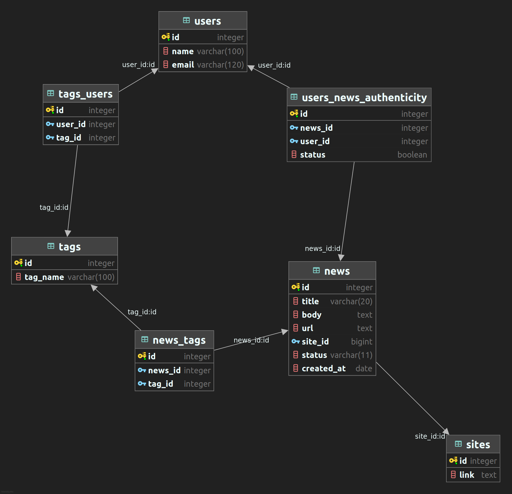
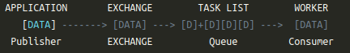

# News Buster

<br />
<div id="top"></div>
<!-- TABLE OF CONTENTS -->
<details>
  <summary>Table of Contents</summary>
  <ol>
    <li>
      <a href="#about-the-project">About The Project</a>
      <ul>
        <li><a href="#built-with">Built With</a></li>
        <li><b><a href="#flow-of-project">Project Flow</a></b></li>
      </ul>
    </li>
    <li><a href="#getting-started">Getting Started</a></li>
      <ul>
        <li><a href="#prerequisite">Prerequisite</a></li>
        <li><a href="#installation">Installation</a></li>
      </ul>
    <li><a href="#contributing">Contributing</a></li>
    <li><a href="#contact">Contact</a></li>
    <li><a href="#acknowledgments">Acknowledgments</a></li>
  </ol>
</details>


<!-- ABOUT THE PROJECT -->

## About The Project

<div id="about-the-project"></div>

News filter Check the authenticity of the same news what we receive & response to someone's request to confirm
authenticity.

<p align="right">(<a href="#top">back to top</a>)</p>

### Built With

<div id="built-with"></div>
This section should list any major frameworks/libraries used to bootstrap your project. Leave any add-ons/plugins for
the acknowledgements section. Here are a few examples.

* [Flask](https://flask.palletsprojects.com/en/2.0.x/)
* [Celery](https://flask.palletsprojects.com/en/2.0.x/patterns/celery/)
* [RabbitMQ](https://www.rabbitmq.com/)
* [Flask-SQLAlchemy](https://flask-sqlalchemy.palletsprojects.com/en/2.x/)

<p align="right">(<a href="#top">back to top</a>)</p>
<!-- flow-of-project -->

### Project Floor Plan
<div id="flow-of-project"></div>
<!-- TODO: finalising the code flow here -->

- Required APIs:
    * Adding new User
    * Adding new preference option
    * Adding new preference to User
    * Email confirmation by user

- Database UML:


<p align="right">(<a href="#top">back to top</a>)</p>

<!-- GETTING STARTED -->

## Getting Started

<div id="getting-started"></div>
All the needed requirements are exported into the `requirements.txt` file which can be executed below-mentioned command.
Project is ready to deploy on heroku servers.

### Prerequisites
<div id="prerequisite"></div>

* Desired python and pip version.
  ```sh
  python >= 3.8.12
  pip >= 21.3.1
  ```

* Other requirements.<br>
    - [rabbitMQ](https://computingforgeeks.com/how-to-install-latest-rabbitmq-server-on-ubuntu-linux/)
    - [postgreSQL](https://www.digitalocean.com/community/tutorials/how-to-install-postgresql-on-ubuntu-20-04-quickstart)

### Installation

<div id="installation"></div>

1. Clone the repo
   ```sh
   git clone https://github.com/cupid-22/news-buster.git
   ```
2. Install pip packages
   ```sh
   pip install -r requirements.txt 
   ```
3. Initiate rabbitMQ as Message Broker
   ```sh
   sudo systemctl start rabbitmq-server.service
   ```
   

<p align="right">(<a href="#top">back to top</a>)</p>

<!-- CONTRIBUTING -->

## Contributing

<div id="contributing"></div>

Contributions are what make the open source community such an amazing place to learn, inspire, and create. Any
contributions you make are **greatly appreciated**.

If you have a suggestion that would make this better, please fork the repo and create a pull request. You can also
simply open an issue with the tag "enhancement". Don't forget to give the project a star! Thanks again!

1. Fork the Project
2. Create your Feature Branch (`git checkout -b feature/AmazingFeature`)
3. Commit your Changes (`git commit -m 'Add some AmazingFeature'`)
4. Push to the Branch (`git push origin feature/AmazingFeature`)
5. Open a Pull Request

<p align="right">(<a href="#top">back to top</a>)</p>


<!-- CONTACT -->

## Contact

<div id="contact"></div>

Gaurav Mishra - [@Linkedin](https://www.linkedin.com/in/gaurav-mishra-work/) - gaurav.mishra.cx@gmail.com

Project Link: [https://github.com/cupid-22/news-buster.git](https://github.com/cupid-22/news-buster.git)

<p align="right">(<a href="#top">back to top</a>)</p>


<!-- ACKNOWLEDGMENTS -->

## Acknowledgments

<div id="acknowledgments"></div>

This project takes some boilerplate code from some of these sites and understanding from others.

* [Automated Web Scraping with python and celery](https://codeburst.io/automated-web-scraping-with-python-and-celery-ac02a4a9ce51)
* [ReadME boilerplate](https://github.com/othneildrew/Best-README-Template/edit/master/README.md)

<p align="right">(<a href="#top">back to top</a>)</p>
